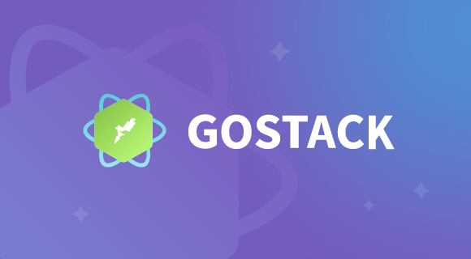

<h1 align="center">
  
</h1>

<h4 align="center">
	Go Barber
</h4>

<p align="center">
  

  

  <a href="https://www.linkedin.com/in/lucasdeveloperti/">
    
  </a>

  <a href="https://github.com/lucas-eduardo/go-stack-11.0/commits/master">
    
  </a>

  

   <a href="https://github.com/lucas-eduardo/go-stack-11.0/stargazers">
    
  </a>
</p>

## 💻 Sobre o projeto

O Projeto foi desenvolvido durante o bootcamp Go Stack organizado pela [Rocketseat](rc).

---

## 🛠 Principais ferramentas

As principais ferramentas foram usadas na construção do projeto:

- [React][reactjs]
- [React Native][reactnative]
- [TypeScript][typescript]
- [Express][express]
- [Express][express]
- [TypeORM][typeorm]
- [Jest][jest]

### 🧭 Rodando a aplicação (API)

```bash
# Clone este repositório
$ git clone https://github.com/lucas-eduardo/go-stack-11.0

# Acesse a pasta do projeto no seu terminal/cmd
$ cd go-stack-11.0/api

# Instale as dependências
$ yarn install

# Execute a aplicação em modo de desenvolvimento
$ yarn start

# A aplicação será aberta na porta:3000 - acesse http://localhost:3333
```

### 🧭 Rodando a aplicação (Web)

```bash
# Clone este repositório
$ git clone https://github.com/lucas-eduardo/go-stack-11.0

# Acesse a pasta do projeto no seu terminal/cmd
$ cd go-stack-11.0/web

# Instale as dependências
$ yarn install

# Execute a aplicação em modo de desenvolvimento
$ yarn start

# A aplicação será aberta na porta:3000 - acesse http://localhost:3000
```

### 🧭 Rodando a aplicação (Mobile)

```bash
# Clone este repositório
$ git clone https://github.com/lucas-eduardo/go-stack-11.0

# Acesse a pasta do projeto no seu terminal/cmd
$ cd go-stack-11.0/mobile

# Instale as dependências
$ yarn install

# Execute a aplicação em modo de desenvolvimento
$ yarn start

# Fazer a instalação no android
$ yarn android
```

#### JSON dos requests da API
[](https://insomnia.rest/run/?label=Bitcoin%20Easy&uri=https%3A%2F%2Fraw.githubusercontent.com%2Flucas-eduardo%2Fbitcoin-easy%2Fmaster%2F.github%2FschemaRequest.json%3Ftoken%3DAFO3JCV222TNSY77MEYD7J2647UV2)

[nodejs]: https://nodejs.org/
[typescript]: https://www.typescriptlang.org/
[express]: https://expressjs.com/
[typeorm]: https://typeorm.io/
[jest]: https://jestjs.io/
[reactjs]: https://reactjs.org
[reactnative]: https://reactnative.dev/
[yarn]: https://yarnpkg.com/
[vscode]: https://code.visualstudio.com/
[license]: https://opensource.org/licenses/MIT
